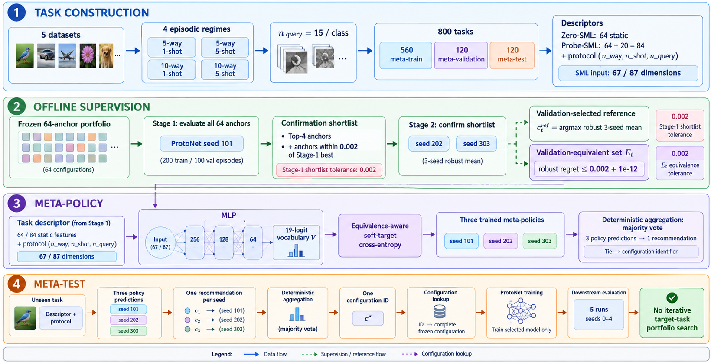

# Static Meta-Learning for Direct Hyperparameter Recommendation in Few-Shot Image Classification

A reproducible official research implementation of **Static Meta-Learning (SML)** for direct configuration recommendation in few-shot image classification as Communicated in the Neural Computing and Applications, Springer; decision pending:

> **Static Meta-Learning for Direct Hyperparameter Recommendation in Few-Shot Image Classification**

The framework learns a task-conditioned mapping from compact episode descriptors to a configuration from a frozen 64-anchor hyperparameter portfolio, avoiding iterative target-task portfolio search.

The repository contains the full experimental pipeline: class-disjoint dataset preparation, deterministic few-shot task generation, descriptor extraction, two-stage validation-selected reference construction, Zero-SML and Probe-SML meta-learning, Neural Performance Predictor (Probe-NPP), Random Search, Bayesian Optimization, Hyperband, BOHB, strict five-dataset leave-one-dataset-out (LODO) evaluation, held-out testing, paired bootstrap analysis, and paper-figure/table generation.

<p align="center">


</p>

---

# Overview

The central problem is expensive hyperparameter optimization for few-shot classification. Conventional HPO methods repeatedly evaluate candidate configurations on every new task. SML instead amortizes this decision offline across a collection of deterministic meta-tasks.

The core pipeline is:

```text
Few-shot task
    ↓
Task descriptor + episodic protocol
    ↓
Meta-policy
    ↓
Configuration ID from frozen 64-anchor portfolio
    ↓
Configuration lookup
    ↓
Train selected Prototypical Network
    ↓
Held-out evaluation
```

Two learned recommendation variants are provided:

- **Zero-SML**: 64 static descriptor features + 3 episodic protocol variables = **67-dimensional input**.
- **Probe-SML**: 64 static descriptor features + 20 fixed optimization-probe features + 3 protocol variables = **87-dimensional input**.

Both policies use an equivalence-aware target over a **19-configuration meta-training vocabulary** rather than forcing every training task to have a single one-hot target.

---

# Key Contributions

- Task-conditioned direct hyperparameter recommendation over a frozen **64-anchor** portfolio.
- Deterministic benchmark of **800 few-shot tasks** across five visual datasets and four episodic regimes.
- **Zero-SML** and **Probe-SML** MLP policies with equivalence-aware soft targets.
- Two-stage validation-selected reference construction with a robust **three-seed** score.
- Exact validation-equivalence rule for the target set used by the meta-policy.
- **Probe-NPP** neural performance-prediction baseline with explicit candidate encoding.
- Reproducible comparisons against **Random Search, Bayesian Optimization, Hyperband, and BOHB**.
- Strict **leave-one-dataset-out** generalization evaluation across all five datasets.
- Leakage-isolated recommendation locking using SHA-256 manifests before held-out test measurement.
- Task-level paired bootstrap analysis with **20,000 resamples**.
- Publication-oriented tables, figures, logs, manifests, and checksums.

---

# Architecture

The implementation follows four conceptual stages.

<p align="center">



</p>

The standard final recommendation workflow uses a frozen portfolio and does not run an iterative target-task search after the task descriptor is constructed.

---

# Repository Structure

```text
ml_dl_cp/
│
├── configs/
│   ├── base.yaml
│   ├── protocols/
│   │   ├── final_meta_learning_v2.json
│   │   ├── final_oracle_budget_v2.json
│   │   ├── final_oracle_strategy_v2.json
│   │   └── budget_stability_tasks.json
│   └── search_spaces/
│       ├── oracle_anchors_40.json
│       └── oracle_anchors_v2_64.json
│
├── src/sml_hpo/
│   ├── baselines/
│   ├── data/
│   ├── descriptors/
│   ├── episodes/
│   ├── evaluation/
│   ├── meta_learner/
│   ├── models/
│   ├── oracle/
│   ├── tasks/
│   ├── training/
│   └── utils/
│
├── scripts/
│   ├── generate_anchor_configs_v2.py
│   ├── generate_final800_manifests.py
│   ├── extract_zero_descriptors.py
│   ├── extract_probe_descriptors.py
│   ├── extract_final800_descriptors.py
│   ├── build_meta_learning_dataset_v2.py
│   ├── finalize_oracle_task_v2.py
│   ├── merge_final_oracle_labels_v2.py
│   ├── train_equivalence_mlp_v2.py
│   ├── train_zero_sml_v2.py
│   ├── fit_frozen_meta_ensembles_v2.py
│   ├── generate_locked_test_recommendations_v2.py
│   ├── run_npp_baseline_v2.py
│   ├── run_random_search_baseline_v2.py
│   ├── run_bayesian_optimization_baseline_v2.py
│   ├── run_hyperband_baseline_v2.py
│   ├── run_bohb_baseline_v2.py
│   ├── run_lodo_sml_v3.py
│   ├── run_lodo_npp_v3.py
│   ├── run_lodo_final_test_worker_v3.py
│   ├── analyze_final_test_results_v2.py
│   ├── analyze_lodo_generalization_v3.py
│   └── generate_final_paper_figures_v2.py
│
├── figures/final_v2/
│   ├── Fig1A_Final_TaskDescriptorPCA.*
│   ├── Fig2_Final_HeldOutAccuracy.*
│   ├── Fig3_Final_PairedBootstrap.*
│   ├── Fig4_Final_DatasetWiseAccuracy.*
│   ├── Fig5_Final_RegimeWiseAccuracy.*
│   ├── Fig6_Final_LODO_vs_RandomSearch.*
│   ├── Fig7_Final_CostAccuracy.*
│   └── Fig8_Final_RecommendationQuality.*
│
├── results/
│   ├── descriptors/
│   ├── oracles/
│   ├── meta_learning/
│   ├── hpo_baselines_v2/
│   ├── lodo_generalization_v3/
│   ├── final_analysis_v2/
│   ├── reviewer_final_analysis_v3/
│   ├── final_test_eval_v2/
│   ├── tables/
│   ├── checkpoints/
│   └── logs/
│
├── archive/
│   └── historical experiments and earlier protocol snapshots
│
├── pyproject.toml
├── requirements-lock.txt
├── environment_report.txt
└── README.md
```

The `archive/` directory contains earlier experimental branches and historical artifacts. The active final pipeline is under `src/`, `scripts/`, `configs/`, `figures/`, and the corresponding current `results/` directories.

---

# Experimental Benchmark

## Datasets

The benchmark uses five visual datasets:

- **Omniglot**
- **CIFAR-100**
- **miniImageNet**
- **DTD**
- **Flowers102**

Each dataset contributes:

- 112 meta-training tasks
- 24 meta-validation tasks
- 24 meta-test tasks

for a total of 160 tasks per dataset and **800 tasks overall**.

## Episodic regimes

The four regimes are fixed as follows:

| Regime | Ways | Shots / class | Queries / class |
|---|---:|---:|---:|
| 5w1s | 5 | 1 | 15 |
| 5w5s | 5 | 5 | 15 |
| 10w1s | 10 | 1 | 10 |
| 10w5s | 10 | 5 | 10 |

Each dataset/regime combination contributes **28 train + 6 validation + 6 test = 40 tasks**, producing:


after all 20 dataset/regime combinations:

```text
Meta-train      20 × 28 = 560 tasks
Meta-validation 20 ×  6 = 120 tasks
Meta-test       20 ×  6 = 120 tasks
Total                         800 tasks
```

Task generation uses deterministic SHA-256-derived seeds rather than Python's process-randomized hash function.

Task construction seed:

```text
20260805
```

Dataset class split seed:

```text
42
```

Common image size:

```text
84 × 84
```

## Episode seed banks

Each task stores fixed episode seed banks for:

- 300 training episodes
- 100 validation episodes
- 600 test episodes

The reference/HPO full-budget objective uses the first **200 training episodes + 100 validation episodes**. Final held-out evaluation uses the independent **600-episode test bank**.

---

# Dataset Splits

## Omniglot

The implementation uses Torchvision's separate Omniglot background and evaluation class universes.

```text
Background classes: 964
    ├── Meta-train:      771
    └── Meta-validation: 193

Evaluation classes: 659
    └── Meta-test:       659
```

The 771/193 split is class-disjoint within the background set, while all evaluation classes are reserved for meta-testing.

## CIFAR-100

The official train and test image partitions are combined so each class retains all 600 images, after which deterministic class-disjoint meta splits are created:

```text
64 classes  → meta-train
16 classes  → meta-validation
20 classes  → meta-test
```

## miniImageNet

The repository expects the standard Ravi/Larochelle-style cached miniImageNet files:

```text
mini-imagenet-cache-train.pkl
mini-imagenet-cache-val.pkl
mini-imagenet-cache-test.pkl
```

Class names are checked across the three official class partitions and must be mutually disjoint.

## DTD

The official train/validation/test image partitions are combined before deterministic class partitioning:

```text
27 classes  → meta-train
10 classes  → meta-validation
10 classes  → meta-test
```

The first official DTD partition is used (`partition=1`).

## Flowers102

The official train/validation/test image partitions are combined before deterministic class partitioning:

```text
64 classes  → meta-train
18 classes  → meta-validation
20 classes  → meta-test
```

---

# Image Preprocessing

All task images are transformed to **84×84 RGB tensors**.

### Omniglot

- resize to 84×84
- grayscale converted to 3 channels
- normalization:
  - mean `(0.5, 0.5, 0.5)`
  - std `(0.5, 0.5, 0.5)`

### CIFAR-100

- resize to 84×84 with antialiasing
- normalization:
  - mean `(0.5071, 0.4867, 0.4408)`
  - std `(0.2675, 0.2565, 0.2761)`

### miniImageNet, DTD, Flowers102

- resize to 84×84 with antialiasing
- ImageNet-style normalization:
  - mean `(0.485, 0.456, 0.406)`
  - std `(0.229, 0.224, 0.225)`

---

# Task Construction

A task is a deterministic episode distribution defined by:

```text
TaskSpec
├── dataset
├── split
├── class_ids
├── task_seed
├── n_way
├── n_shot
├── n_query
├── training episode count
├── validation episode count
└── test episode count
```

For every generated task, fixed train/validation/test seed banks are created from deterministic offsets of the task seed.

Within each dataset/split/regime combination, unique class pools are generated whenever the available class pool permits it. A task remains distinct even if class-pool repetition is unavoidable because its episode seed banks remain independent and deterministic.

---

# Base Learner: Prototypical Network

The downstream few-shot classifier is a **four-block Prototypical Network encoder with Group Normalization**.

Each convolutional block is:

```text
3×3 convolution
↓
GroupNorm
↓
ReLU
↓
2×2 MaxPool
```

The four blocks are followed by:

```text
AdaptiveAvgPool(1×1)
↓
Flatten
↓
Dropout
↓
Embedding projection
```

The base architecture identifier is:

```text
conv4_groupnorm_v2
```

Group count is selected from 8, 4, 2, or 1 so the number of groups divides the channel count.

The ProtoNet supports:

- Euclidean distance
- Cosine distance
- temperature scaling

and uses the episode support prototypes to classify query embeddings.

---

# Frozen 64-Anchor Configuration Portfolio

The final portfolio contains **64 frozen configurations** generated by a mixed Latin-hypercube procedure.

Manifest:

```text
configs/search_spaces/oracle_anchors_v2_64.json
```

Generation seed:

```text
20260804
```

The portfolio varies:

### Optimizer

- Adam
- AdamW
- SGD

### Hidden channels

```text
32, 64, 96, 128
```

### Embedding dimension

```text
32, 64, 128, 256
```

### Dropout

```text
0.0, 0.1, 0.3
```

### Scheduler

- none
- cosine

### Distance metric

- euclidean
- cosine

### Label smoothing

```text
0.00, 0.05, 0.10
```

### Learning rate

Log-scaled ranges depend on optimizer:

```text
Adam / AdamW: 1e-5  → 5e-3
SGD:          1e-3  → 2e-1
```

### Weight decay

```text
1e-7 → 1e-2, log-scaled
```

### Temperature

```text
Euclidean: 0.25 → 4.0
Cosine:    0.05 → 1.0
```

Fixed base-learner settings include:

```text
input_channels      = 3
encoder_depth       = 4
normalization       = GroupNorm
gradient_clip_norm   = 5.0
SGD momentum        = 0.9
cosine eta_min ratio = 0.01
```

---

# Reference Construction

The reference is deliberately a **validation-selected reference from the frozen portfolio**, not a claim of a global continuous optimum.

## Stage 1: Full portfolio screening

All 64 anchors are evaluated using:

```text
ProtoNet model seed = 101
training episodes   = 200
validation episodes = 100
```

## Stage 2: Confirmation shortlist

The confirmation set is:

```text
Top-4 Stage-1 anchors
        UNION
All anchors within 0.002 validation accuracy of the Stage-1 best
```

## Stage 2 evaluation

The shortlist is re-evaluated with model seeds:

```text
202
303
```

The final robust validation score is:

```text
mean of seeds 101, 202, and 303
```

The validation-selected reference configuration is the highest-scoring configuration under this robust three-seed mean.

---

# Exact Validation-Equivalent Set E_t

For a task `t`, let:

```text
C_t^confirm = Stage-2 confirmation candidates
```

and let:

```text
Ā_val(t,c) = mean validation accuracy over seeds 101, 202, 303
```

The reference is:

```text
c_t^ref = argmax over c ∈ C_t^confirm of Ā_val(t,c)
```

The exact equivalence rule is:

```text
E_t = {
    c ∈ C_t^confirm :
    Ā_val(t,c_t^ref) - Ā_val(t,c) ≤ 0.002
}
```

The implementation performs the numerical comparison as:

```python
robust_regret <= 0.002 + 1e-12
```

Thus the same numerical tolerance appears in two different stages:

```text
0.002 for Stage-1 confirmation-shortlist construction
0.002 for robust validation-equivalence membership
```

The two uses are not the same operation: the first uses seed-101 Stage-1 performance over all 64 anchors; the second uses the robust three-seed validation mean over the Stage-2 candidate set.

The meta-training equivalent-set vocabulary contains **19 anchor IDs**.

---

# Task Descriptors

## Zero-SML: 64 static features

The 64 static descriptors are organized into four families.

| Descriptor family | Dimensions |
|---|---:|
| Pixel-level statistics | 14 |
| Texture and edge descriptors | 22 |
| Prototype geometry | 18 |
| Spectral / PCA descriptors | 10 |
| **Total** | **64** |

### Pixel features

The implementation includes channel and global statistics such as means, standard deviations, entropy, skewness, kurtosis, dynamic range, contrast ratio, and saturation fraction.

### Texture features

The implementation includes gradient statistics, Sobel responses, edge density, Laplacian statistics, high-frequency energy, Gabor responses at multiple orientations, Tamura-style measures, and LBP uniformity.

### Prototype geometry

Prototype and embedding geometry includes intra-class variance, inter-prototype distance statistics, nearest-prototype distances, embedding norms, Fisher ratio, cluster compactness, centroid separation, and separation-to-variance ratio.

### Spectral features

Spectral information includes PCA explained-variance ratios, effective rank, normalized entropy, spectral flatness, anisotropy, and a log condition number.

---

# Probe-SML: Additional 20 Optimization Signals

Probe-SML appends 20 signals generated by a short fixed optimization probe.

The probe uses:

```text
Probe model: ProtoNet
hidden channels: 64
embedding dimension: 64
dropout: 0
optimizer: AdamW
learning rate: 3e-4
weight decay: 1e-4
probe steps: 20
validation episodes: 5
probe initialization seed: 20260802
curvature relative epsilon: 1e-3
gradient clipping: 5.0
```

The 20 probe signals are:

1. Initial training loss
2. Final training loss
3. Mean training loss
4. Training-loss standard deviation
5. Training-loss slope
6. Initial training accuracy
7. Final training accuracy
8. Mean training accuracy
9. Validation loss
10. Validation accuracy
11. Mean gradient norm
12. Gradient-norm standard deviation
13. Maximum gradient norm
14. Mean gradient variance
15. Mean update norm
16. Mean update-to-parameter ratio
17. Mean consecutive-gradient cosine
18. Standard deviation of consecutive-gradient cosine
19. Directional curvature
20. Gradient-Hessian alignment

Therefore:

```text
Zero-SML descriptor = 64
Probe-SML descriptor = 64 + 20 = 84
```

Neither probe features nor probe hyperparameters are tuned per target task; the probe procedure is fixed.

---

# SML Model

Both SML variants use the same multilayer perceptron topology.

```text
Input
  ↓
Linear
  ↓
LayerNorm(256)
  ↓
GELU
  ↓
Dropout(0.20)
  ↓
Linear(128)
  ↓
LayerNorm(128)
  ↓
GELU
  ↓
Dropout(0.20)
  ↓
Linear(64)
  ↓
LayerNorm(64)
  ↓
GELU
  ↓
Dropout(0.10)
  ↓
19 logits
```

### Zero-SML input

```text
64 static features
+ 3 protocol variables
= 67 dimensions
```

### Probe-SML input

```text
84 descriptor features
+ 3 protocol variables
= 87 dimensions
```

Protocol variables:

```text
n_way
n_shot
n_query
```

Dataset identity is not supplied to the learned SML policies.

### Training objective

The target for each task is a uniform distribution over the represented members of its validation-equivalent set:

```text
q_t(c) = 1 / |E_t|    if c ∈ E_t
         0             otherwise
```

The loss is soft-target cross entropy.

### Optimizer

```text
AdamW
learning rate = 1e-3
weight decay  = 1e-4
batch size    = 64
gradient clip = 5.0
```

### Standard meta-learning protocol

```text
Meta-train tasks      = 560
Meta-validation tasks = 120
Final refit tasks     = 680
Meta-test tasks       = 120
```

The frozen meta-policy output vocabulary contains 19 configuration IDs.

---

# SML Recommendation Aggregation

The standard ensemble uses independently trained meta-policies and deterministic majority voting.

For the frozen three-seed policy protocol:

```text
Meta-policy seeds:
101, 202, 303
```

Each policy produces one configuration ID per test task.

Aggregation:

```text
majority vote
    ↓
tie → lexicographically smallest configuration ID
```

The selected configuration ID is then mapped back to the complete frozen 64-anchor configuration.

For the five-run robustness study, the same pipeline is repeated with independent meta-policy seeds:

```text
0, 1, 2, 3, 4
```

Five-run reporting therefore measures variability of independently trained recommendation policies; the predictions are not averaged as regression scores before selecting the configuration.

---

# Probe-NPP Baseline

Probe-NPP is a separate learned performance-ranking baseline rather than a direct 19-class SML policy.

For each task, the model scores all 64 anchor candidates.

## Input representation

```text
84 Probe-SML descriptor features
+ 3 protocol variables
+ 14-D candidate configuration encoding
= 101-dimensional input
```

The 14-dimensional candidate encoding contains:

```text
7 standardized numeric features
├── log10 learning rate
├── log10 weight decay
├── log2 hidden channels
├── log2 embedding dimension
├── dropout
├── log10 temperature
└── label smoothing

3 optimizer one-hot features
2 scheduler one-hot features
2 distance-metric one-hot features
```

The candidate encoding is derived only from the frozen portfolio configuration and does not use task performance.

## Network

```text
101
 ↓
Linear(128)
 ↓
ReLU
 ↓
Dropout(0.1)
 ↓
Linear(64)
 ↓
ReLU
 ↓
Linear(1)
```

The scalar output predicts task/candidate validation accuracy.

## Training

```text
Loss          = MSE
Optimizer     = Adam
Learning rate = 1e-3
Explicit WD   = 0
Batch size    = 256
Max epochs    = 200
Patience      = 30
Seeds         = 0,1,2,3,4
```

Epoch selection uses validation recommendation quality, with the primary criterion being mean validation regret and RMSE used as the secondary criterion in the finalized NPP implementation.

NPP is refit on the 680 development tasks after model-selection decisions are frozen, then deployed to held-out test tasks. Test oracle labels and the final test bank are excluded from predictor training and model selection.

---

# Classical Static Baselines

The repository also contains classical feature-based recommenders:

- Weighted Logistic Regression
- Weighted Random Forest
- Weighted Extra Trees
- Equivalence-aware k-nearest-neighbor ranking with `k=15`

These baselines operate on Zero-SML or Probe-SML descriptors and use the same frozen task-level supervision.

Privileged static defaults are also evaluated:

- Global majority configuration
- Regime majority configuration
- Dataset majority configuration
- Dataset + regime majority configuration

Dataset-aware baselines are explicitly treated as privileged because dataset identity is not supplied to the learned SML policies.

---

# Iterative HPO Baselines

The repository implements four target-task search baselines over the same frozen 64-anchor portfolio.

## Random Search

```text
Trials per run = 40
Search seeds   = 0,1,2,3,4
```

The candidate subset is sampled uniformly without replacement from the 64-anchor portfolio for each search seed. Each candidate is evaluated using the common HPO validation protocol.

## Bayesian Optimization

```text
Calls           = 20
Initial random = 5
Search seeds    = 0,1,2,3,4
Acquisition     = Expected Improvement
xi              = 0.001
```

The discrete search is performed directly over the 64-anchor candidate pool. The surrogate is a Gaussian Process with:

```text
ConstantKernel × Matern(nu=2.5) + WhiteKernel
```

using standardized anchor features.

## Hyperband

```text
Minimum resource = 25 training episodes
Maximum resource = 200 training episodes
eta              = 2
Search seeds     = 0,1,2,3,4
```

Partial-fidelity results are cached. Full-budget configurations reuse the frozen full-budget validation measurements where applicable.

## BOHB

The finite-portfolio BOHB implementation uses the same:

```text
min resource = 25
max resource = 200
eta          = 2
```

and additionally uses:

```text
good fraction       = 0.15
minimum model points = 6
KDE bandwidth        = 0.5
```

It models the most informative available fidelity and falls back to random proposals during warm-up/insufficient-model regimes.

---

# Leakage Isolation and Recommendation Locking

The final evaluation protocol explicitly separates recommendation generation from held-out measurement.

Before final test evaluation:

- Test oracle labels are unavailable to SML/NPP training.
- Test oracle labels are unavailable to model selection.
- Final test accuracy is not used for recommendation generation.
- The test bank is not read before recommendations are locked.
- The recommendation CSV is SHA-256 hashed.
- Model checkpoints and scalers are included in the lock manifest.

The locked recommendation manifest records the input data, frozen checkpoints, scalers, recommendation file, and SHA-256 digests.

This prevents post-hoc configuration selection using test information.

---

# Strict Leave-One-Dataset-Out (LODO)

The repository includes a strict five-fold cross-dataset generalization experiment.

For each fold, one entire dataset is held out.

```text
4 source datasets
    ↓
448 source meta-train tasks
    ↓
96 source meta-validation tasks
    ↓
544 source development tasks
    ↓
Refit learned recommender
    ↓
24 held-out target tasks
```

The held-out dataset contributes **zero tasks** to:

- learned-model training
- meta-validation
- scaler fitting during model selection
- epoch selection
- output-vocabulary construction
- source-development refitting

The target descriptors may be computed at deployment time, but target oracle labels are not used to train or select the recommender.

LODO is implemented for:

- Zero-SML
- Probe-NPP
- Random Search
- Bayesian Optimization
- Hyperband
- BOHB

---

# Final Standard Benchmark Results

The final five-run analysis reports the following overall held-out accuracy means.

| Method | Mean test accuracy | Five-run SD | Target-task search cost |
|---|---:|---:|---:|
| Validation-selected reference | 63.212% | — | 73.1 anchor-seed jobs |
| Zero-SML | **62.964%** | 0.019 pp | 0 FBE |
| Probe-SML | **62.946%** | 0.045 pp | 0 FBE |
| Probe-NPP | 62.359% | 0.187 pp | 0 FBE |
| Random Search | 62.647% | 0.068 pp | 40 FBE |
| Bayesian Optimization | 62.161% | 0.094 pp | 20 FBE |
| Hyperband | 61.265% | 0.189 pp | 16 FBE |
| BOHB | 61.195% | 0.333 pp | 16 FBE |

`FBE` denotes a full-budget training-equivalent target-task configuration evaluation.

The main result should be interpreted as **direct recommendation without iterative target-task portfolio search**, not as elimination of the selected base-learner training itself.

---

# LODO Results

The strict five-fold LODO analysis gives:

| Method | Omniglot held out | CIFAR-100 held out | miniImageNet held out | DTD held out | Flowers102 held out | Overall |
|---|---:|---:|---:|---:|---:|---:|
| Random Search (40) | 99.947 ± 0.045 | 44.635 ± 0.141 | 41.314 ± 0.049 | 37.830 ± 0.242 | 89.509 ± 0.149 | 62.647 ± 0.068 |
| Bayesian Optimization (20) | 99.597 ± 0.329 | 44.174 ± 0.166 | 40.718 ± 0.196 | 37.423 ± 0.237 | 88.892 ± 0.533 | 62.161 ± 0.094 |
| Hyperband | 99.344 ± 0.382 | 43.907 ± 0.148 | 39.970 ± 0.482 | 35.828 ± 0.340 | 87.277 ± 0.576 | 61.265 ± 0.189 |
| BOHB | 98.842 ± 1.088 | 43.757 ± 0.543 | 39.906 ± 0.672 | 35.862 ± 0.630 | 87.608 ± 1.135 | 61.195 ± 0.333 |
| LODO Probe-NPP | 93.154 ± 9.280 | 44.559 ± 0.115 | 40.309 ± 0.586 | 35.153 ± 0.488 | 88.631 ± 0.326 | 60.361 ± 1.852 |
| **LODO Zero-SML** | **99.895 ± 0.000** | **44.808 ± 0.048** | **40.711 ± 0.254** | **37.335 ± 0.566** | **89.808 ± 0.279** | **62.511 ± 0.119** |

For LODO, target-task search cost remains zero for the two learned direct-recommendation methods.

---

# Paired Statistical Analysis

Final standard comparisons use:

```text
120 held-out tasks
20,000 paired bootstrap resamples
Task-level inferential unit
Five recommendation/search runs averaged within task before inference
```

The analysis focuses on paired task-level accuracy differences rather than comparing heterogeneous absolute accuracy scales in isolation.

The main repository outputs include:

```text
results/reviewer_final_analysis_v3/paired_bootstrap_comparisons.csv
results/final_analysis_v2/paired_bootstrap_comparisons.csv
results/lodo_generalization_v3/final_analysis/paired_bootstrap_overall.csv
results/lodo_generalization_v3/final_analysis/paired_bootstrap_by_dataset.csv
```

---

# Search Cost Interpretation

The computational-cost analysis distinguishes between:

1. **Target-task HPO cost**: configuration evaluations on the new task.
2. **Base-model training cost**: the final selected ProtoNet training.
3. **Offline meta-learning cost**: reference-label generation and meta-policy training.
4. **Probe cost**: the fixed Probe-SML descriptor computation.

Therefore, the zero-FBE SML/NPP entries do **not** mean zero computation. They mean that the learned recommender does not perform iterative target-task portfolio search after recommendation generation.

The validation-selected reference requires screening all 64 anchors and confirming the robust shortlist; its reported mean cost is approximately **73.1 anchor-seed jobs per task**.

---

# Reproducibility Controls

The implementation uses deterministic controls throughout the benchmark.

### Task determinism

- SHA-256-based task seeds
- fixed dataset split seed `42`
- deterministic class pools
- deterministic train/validation/test episode seed banks

### Model determinism

- explicit PyTorch seeds
- NumPy and Python RNG seeding
- deterministic CUDA behavior where supported
- fixed model seeds for reference confirmation and final downstream evaluation

### Artifact integrity

The project stores SHA-256 digests for important manifests, descriptors, recommendation files, checkpoints, and analysis artifacts.

### Protocol freezing

The final meta-learning protocol is explicitly marked:

```text
FROZEN_BEFORE_TEST_ORACLE
```

and checks that test oracle labels have not been read before recommendation generation.

---

# Installation

## Requirements

The package declares:

```text
Python >= 3.10
```

The locked environment used for the supplied experiment contains:

```text
Python       3.12.3
PyTorch      2.13.0+cu130
Torchvision  0.28.0
CUDA build   13.0
NumPy        1.26.4
Pandas       3.0.5
scikit-learn 1.9.0
scikit-image 0.26.0
Optuna       4.9.0
```

A GPU-enabled PyTorch installation is recommended for reproducing the complete benchmark.

## Clone

```bash
git clone github.com/Vinay3579-code/Static-Meta-Learning-Hyperparameter-Optimization-for-Image-Classification
cd ml_dl_cp
```

## Create a virtual environment

```bash
python -m venv .venv
```

### Linux / macOS

```bash
source .venv/bin/activate
```

### Windows

```powershell
.venv\Scripts\activate
```

## Install dependencies

```bash
pip install -r requirements-lock.txt
pip install -e .
```

---

# Dataset Preparation

The dataset loaders live under:

```text
src/sml_hpo/data/
```

The registry supports:

```text
omniglot
cifar100
miniimagenet
dtd
flowers102
```

For DTD and Flowers102, the repository includes:

```bash
python scripts/prepare_crossdomain_data.py
```

For Flowers102 metadata, the dedicated verified downloader is:

```bash
python scripts/download_flowers102_metadata.py
```

For miniImageNet, provide the expected cache files under `data/raw/miniimagenet/`:

```text
mini-imagenet-cache-train.pkl
mini-imagenet-cache-val.pkl
mini-imagenet-cache-test.pkl
```

---

# Reproducing the Main Pipeline

The complete workflow is organized into explicit scripts so that individual stages can be audited or rerun independently.

## 1. Generate the frozen 64-anchor portfolio

```bash
python scripts/generate_anchor_configs_v2.py \
  --count 64 \
  --seed 20260804 \
  --output configs/search_spaces/oracle_anchors_v2_64.json
```

## 2. Generate the 800 deterministic task manifests

```bash
python scripts/generate_final800_manifests.py
```

This creates:

```text
560 train tasks
120 validation tasks
120 test tasks
```

under:

```text
data/manifests/final800/
```

## 3. Extract Zero-SML descriptors

```bash
python scripts/extract_zero_descriptors.py
```

## 4. Extract Probe-SML descriptors

```bash
python scripts/extract_probe_descriptors.py
```

## 5. Build the final 84-dimensional descriptor tables

```bash
python scripts/extract_final800_descriptors.py
python scripts/merge_final800_descriptors.py
```

## 6. Run the reference/oracle construction

The reference-generation pipeline consists of:

```text
run_final_oracle_task_v2.py
run_final_oracle_shard_v2.py
finalize_oracle_task_v2.py
merge_final_oracle_labels_v2.py
merge_test_oracle_labels_v2.py
```

The frozen reference protocol is recorded in:

```text
configs/protocols/final_oracle_strategy_v2.json
configs/protocols/final_oracle_budget_v2.json
```

## 7. Build the meta-learning dataset

```bash
python scripts/build_meta_learning_dataset_v2.py
```

This creates the 680-task development table used for final meta-model refitting.

## 8. Train the equivalence-aware meta-policy

The core implementations are:

```bash
python scripts/train_zero_sml_v2.py \
  --train <train-label-table.csv> \
  --validation <validation-label-table.csv> \
  --output-dir <output-dir> \
  --seed 101
```

and:

```bash
python scripts/train_equivalence_mlp_v2.py \
  --train <train-label-table.csv> \
  --validation <validation-label-table.csv> \
  --output-dir <output-dir>
```

The final frozen ensemble can be refit with:

```bash
python scripts/fit_frozen_meta_ensembles_v2.py \
  --data <all680.csv> \
  --protocol configs/protocols/final_meta_learning_v2.json \
  --output-root <output-root>
```

## 9. Generate locked held-out recommendations

```bash
python scripts/generate_locked_test_recommendations_v2.py
```

This stage produces the recommendation file and cryptographic lock manifest before test oracle labels are consumed.

## 10. Run final held-out evaluation

The downstream selected configurations are evaluated with:

```text
200 training episodes
600 test episodes
ProtoNet seeds 101, 202, 303
```

using:

```bash
python scripts/run_final_test_evaluation_v2.py \
  --recommendations <locked-recommendations.csv> \
  --test-labels <merged-test-labels.csv> \
  --anchors configs/search_spaces/oracle_anchors_v2_64.json \
  --manifest-root <data-manifest-root> \
  --output-root <output-root> \
  --device cuda:0
```

The final results can be merged and analyzed with:

```bash
python scripts/analyze_final_test_results_v2.py
```

---

# Running HPO Baselines

### Random Search

```bash
python scripts/run_random_search_baseline_v2.py
```

### Bayesian Optimization

```bash
python scripts/run_bayesian_optimization_baseline_v2.py
```

### Hyperband

```bash
python scripts/run_hyperband_baseline_v2.py
```

### BOHB

```bash
python scripts/run_bohb_baseline_v2.py
```

The final HPO runs use five independent search seeds:

```text
0, 1, 2, 3, 4
```

while reserving the downstream ProtoNet evaluation seeds for the common final evaluation protocol.

---

# Running Probe-NPP

The standard Probe-NPP implementation is:

```bash
python scripts/run_npp_baseline_v2.py
```

An audit-only mode can be used to inspect the frozen schema without running training:

```bash
python scripts/run_npp_baseline_v2.py --audit-only
```

The implementation checks:

```text
84 descriptor dimensions
87 task-side dimensions
14 anchor-encoding dimensions
101 total NPP input dimensions
64 candidate anchors
680 development tasks
120 held-out tasks
```

---

# Running Strict LODO

### Zero-SML

```bash
python scripts/run_lodo_sml_v3.py
```

### Probe-NPP

```bash
python scripts/run_lodo_npp_v3.py
```

### Held-out pair evaluation

```bash
python scripts/run_lodo_final_test_worker_v3.py
```

### LODO analysis

```bash
python scripts/analyze_lodo_generalization_v3.py
```

Final LODO artifacts are written under:

```text
results/lodo_generalization_v3/
```

---

# Analysis and Figures

The repository includes dedicated scripts for:

- seed stability
- budget stability
- oracle-label analysis
- reviewer baseline analysis
- final test analysis
- static baseline analysis
- task-descriptor PCA
- dataset-wise analysis
- regime-wise analysis
- recommendation-quality analysis
- cost/accuracy analysis
- paired bootstrap comparisons
- LODO generalization

The final paper figure generator is:

```bash
python scripts/generate_final_paper_figures_v2.py
```

The output figure pack contains publication-oriented PDF and PNG versions under:

```text
figures/final_v2/
```

---

# Important Output Artifacts

## Protocols

```text
configs/protocols/final_meta_learning_v2.json
configs/protocols/final_oracle_strategy_v2.json
configs/protocols/final_oracle_budget_v2.json
```

## Search space

```text
configs/search_spaces/oracle_anchors_v2_64.json
```

## Descriptors

```text
results/descriptors/final800/
```

## Reference/oracle labels

```text
results/oracles/final800_v2/
results/oracles/final800_v2_merged/
```

## SML five-run robustness

```text
results/meta_learning/five_run_robustness_v2/
```

This directory contains:

- frozen Zero-SML checkpoints
- frozen Probe-SML checkpoints
- fitted scalers
- validation histories
- recommendation files
- lock manifests
- five-run test results

## Probe-NPP

```text
results/hpo_baselines_v2/npp/
results/lodo_generalization_v3/probe_npp/
```

## HPO baselines

```text
results/hpo_baselines_v2/
```

## Final analyses

```text
results/final_analysis_v2/
results/reviewer_final_analysis_v3/
results/lodo_generalization_v3/final_analysis/
```

## Logs

```text
results/logs/
```

All major experiment stages produce dedicated logs that can be inspected when reproducing the study.

---

# Reproducibility Checks

The repository contains explicit validation scripts for the frozen benchmark, including:

```bash
python scripts/validate_task_manifest.py
python scripts/audit_meta_label_space_v2.py
python scripts/validate_candidate_strategy_holdout_v2_fixed.py
python scripts/verify_baseline_adapter_against_oracle_v2.py
python scripts/smoke_dataset.py
python scripts/smoke_baseline_adapter_v2.py
```

Dataset-specific smoke tests are also available:

```bash
python scripts/smoke_omniglot.py
python scripts/smoke_cifar100.py
```

---

# Research Design Summary

The benchmark separates three fundamentally different forms of configuration selection:

```text
Iterative HPO
    ↓
Repeated target-task configuration evaluations

Neural performance prediction
    ↓
Score candidate configurations with a learned surrogate

Direct SML
    ↓
Predict a configuration directly from the task representation
```

SML therefore occupies the **direct recommendation** end of the HPO cost/adaptivity spectrum. It does not claim to eliminate base-model training; its purpose is to remove repeated target-task portfolio search.

---

# What the Repository Does Not Claim

The experiments are limited to:

- few-shot image classification
- the five included visual datasets
- the Prototypical Network base learner
- the frozen 64-anchor configuration portfolio
- the evaluated descriptor families

The results do not establish that the same recommendation strategy will transfer unchanged to:

- language models
- tabular learning
- time series
- other vision architectures
- continuous hyperparameter spaces outside the 64-anchor portfolio

The validation-selected reference is also not a global optimum. It is the best configuration under the explicitly frozen two-stage validation protocol.

---

# Citation

Associated manuscript title:

> **Static Meta-Learning for Direct Hyperparameter Recommendation in Few-Shot Image Classification**

When the final publication citation is available, add the journal-formatted BibTeX entry here.

---

# Acknowledgements

This implementation builds on the following open-source ecosystem:

- PyTorch
- Torchvision
- scikit-learn
- scikit-image
- NumPy
- Pandas
- Matplotlib
- Optuna
- ConfigSpace / DEHB components used by the environment

Dataset-specific preprocessing follows the interfaces provided by Torchvision and the standard cached miniImageNet representation expected by the repository.

---

# License
